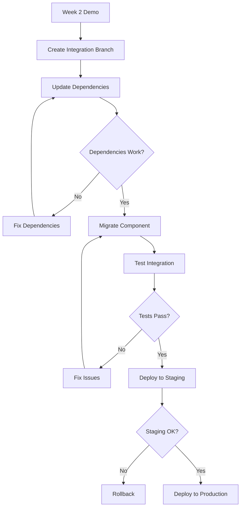

# Production App Integration Strategy

## Executive Summary

This document outlines the strategy for safely integrating Week 2 demo components back into the main production application, addressing dependency conflicts, minimizing risks, and ensuring seamless rollback capabilities.

## Current State Analysis

### Demo Environment Status
- **Location**: `/repo-root/demo/week2-showcase/`
- **Components Extracted**: 11 components (4,073 total lines)
- **Dependencies Removed**: tRPC, Clerk, React Query, Prisma
- **Status**: Fully functional standalone environment

### Main App Dependencies (Current Issues)
```json
{
  "problematic": {
    "@tanstack/react-query": "^4.x vs ^5.x version mismatch",
    "@clerk/nextjs": "Authentication blocking public routes",
    "@trpc/client": "Complex state management integration",
    "prisma": "Database connection requirements"
  },
  "working": {
    "react": "^18.2.0",
    "next": "^14.1.0", 
    "typescript": "^5.0.0",
    "tailwindcss": "^3.3.0"
  }
}
```

## Integration Strategy

### Phase 1: Safe Component Re-integration (Week 3 Start)

#### 1.1 Dependency Modernization
```bash
# Step 1: Update main app dependencies
cd apps/web
npm update @tanstack/react-query@^5.0.0
npm update @clerk/nextjs@latest
npm update @trpc/client@latest

# Step 2: Test dependency compatibility
npm run build  # Must succeed
npm run test   # Must pass
```

#### 1.2 Component Migration Pattern
```typescript
// Pattern: Gradual replacement with feature flags
interface ComponentProps {
  // Keep original interface intact
  useDemo?: boolean;  // Feature flag for demo components
}

export const LegalPrivacyPage = ({ useDemo = false }: ComponentProps) => {
  if (useDemo || process.env.USE_DEMO_COMPONENTS === 'true') {
    return <DemoPrivacyComponent />;
  }
  return <OriginalPrivacyComponent />;
};
```

#### 1.3 Integration Order (Low Risk First)
1. **Static Components** (Privacy Policy, Terms) - No dependencies
2. **Basic UI Components** (Button, Input, Modal) - Simple replacements
3. **Support Widget** - Requires mock → real API integration
4. **Support Dashboard** - Complex state management integration

### Phase 2: Dependency Resolution Strategy

#### 2.1 Authentication Re-integration
```typescript
// Create abstraction layer for auth
interface AuthAdapter {
  isAuthenticated(): boolean;
  getCurrentUser(): User | null;
  requireAuth(): void;
}

// Demo implementation
class DemoAuthAdapter implements AuthAdapter {
  isAuthenticated() { return true; }
  getCurrentUser() { return mockUser; }
  requireAuth() { /* no-op */ }
}

// Production implementation  
class ClerkAuthAdapter implements AuthAdapter {
  isAuthenticated() { return !!auth().userId; }
  getCurrentUser() { return currentUser(); }
  requireAuth() { redirect('/sign-in'); }
}

// Component usage
const authAdapter = process.env.NODE_ENV === 'development' 
  ? new DemoAuthAdapter() 
  : new ClerkAuthAdapter();
```

#### 2.2 API Integration Pattern
```typescript
// Create API abstraction
interface ApiAdapter {
  createTicket(data: TicketData): Promise<Ticket>;
  getTickets(): Promise<Ticket[]>;
  updateTicketStatus(id: string, status: string): Promise<void>;
}

// Demo implementation (current)
class DemoApiAdapter implements ApiAdapter {
  async createTicket(data: TicketData) {
    const ticket = { ...data, id: generateId() };
    const tickets = JSON.parse(localStorage.getItem('tickets') || '[]');
    tickets.push(ticket);
    localStorage.setItem('tickets', JSON.stringify(tickets));
    return ticket;
  }
}

// Production implementation (target)
class TrpcApiAdapter implements ApiAdapter {
  async createTicket(data: TicketData) {
    return await trpc.support.createTicket.mutate(data);
  }
}
```

#### 2.3 Data Migration Strategy
```typescript
// Migrate demo data to real database
const migrateDemoData = async () => {
  // 1. Extract demo localStorage data
  const demoTickets = JSON.parse(localStorage.getItem('tickets') || '[]');
  const demoCookiePrefs = JSON.parse(localStorage.getItem('cookie-preferences') || '{}');
  
  // 2. Transform to production schema
  const productionTickets = demoTickets.map(transformTicket);
  const productionPrefs = transformCookiePreferences(demoCookiePrefs);
  
  // 3. Bulk insert to production database
  await db.ticket.createMany({ data: productionTickets });
  await db.userPreferences.upsert({ data: productionPrefs });
  
  // 4. Clear demo data
  localStorage.removeItem('tickets');
  localStorage.removeItem('cookie-preferences');
};
```

### Phase 3: Rollback Plan

#### 3.1 Feature Flag System
```typescript
// Environment-based rollback
const FEATURE_FLAGS = {
  USE_NEW_LEGAL_PAGES: process.env.FEATURE_NEW_LEGAL === 'true',
  USE_NEW_SUPPORT_WIDGET: process.env.FEATURE_NEW_SUPPORT === 'true',
  USE_NEW_SUPPORT_DASHBOARD: process.env.FEATURE_NEW_DASHBOARD === 'true',
} as const;

// Component-level rollback
export const PrivacyPolicyPage = () => {
  if (FEATURE_FLAGS.USE_NEW_LEGAL_PAGES) {
    return <NewPrivacyPolicy />;
  }
  return <OriginalPrivacyPolicy />;
};
```

#### 3.2 Database Rollback Strategy
```sql
-- Create rollback scripts
-- rollback_support_changes.sql
BEGIN TRANSACTION;

-- Save current state
CREATE TEMP TABLE ticket_backup AS SELECT * FROM tickets;
CREATE TEMP TABLE preferences_backup AS SELECT * FROM user_preferences;

-- Rollback to previous schema version
-- ... rollback statements ...

-- Verify rollback success
SELECT COUNT(*) FROM tickets;  -- Should match previous count

COMMIT;  -- Only if verification passes
```

#### 3.3 Immediate Rollback Procedure
```bash
#!/bin/bash
# emergency_rollback.sh

echo "🚨 EMERGENCY ROLLBACK INITIATED"

# 1. Disable new features
export FEATURE_NEW_LEGAL=false
export FEATURE_NEW_SUPPORT=false  
export FEATURE_NEW_DASHBOARD=false

# 2. Restart application with old code
git checkout main-backup-branch
npm run build:production
pm2 reload all

# 3. Restore database if needed
psql < rollback_support_changes.sql

echo "✅ Rollback complete. Check application status."
```

### Phase 4: Parallel Development Workflow

#### 4.1 Branch Strategy
```
main
├── week2-demo (standalone demo - stable)
├── week3-calculator (new feature development)  
├── integration-branch (controlled integration)
└── production-ready (integration testing)
```

#### 4.2 Development Workflow


#### 4.3 Continuous Integration Checks
```yaml
# .github/workflows/integration-safety.yml
name: Integration Safety Check
on: [push, pull_request]

jobs:
  dependency-check:
    runs-on: ubuntu-latest
    steps:
      - uses: actions/checkout@v3
      - run: npm audit --production
      - run: npm run type-check
      - run: npm run build
      
  component-compatibility:
    runs-on: ubuntu-latest
    steps:
      - run: npm run test:components
      - run: npm run test:integration
      
  rollback-verification:
    runs-on: ubuntu-latest
    steps:
      - run: ./scripts/test-rollback.sh
      - run: ./scripts/verify-feature-flags.sh
```

## Risk Assessment Matrix

| Component | Integration Risk | Rollback Complexity | Dependencies | Mitigation |
|-----------|------------------|---------------------|--------------|------------|
| Legal Pages | LOW | LOW | None | Direct replacement |
| UI Components | LOW | LOW | None | Feature flags |
| Support Widget | MEDIUM | MEDIUM | Auth, API | Adapter pattern |
| Support Dashboard | HIGH | HIGH | Auth, DB, tRPC | Phased rollout |

## Timeline Protection

### Critical Path Dependencies
1. **Week 3**: Dependency resolution (Day 1-2)
2. **Week 3**: Legal pages integration (Day 3-4)  
3. **Week 4**: Support widget integration (Day 1-3)
4. **Week 4**: Support dashboard integration (Day 4-5)
5. **Week 5**: True Rate Calculator (depends on stable foundation)

### Buffer Time Allocation
- **Dependency Resolution**: 2 days planned + 1 day buffer
- **Component Integration**: 3 days planned + 1 day buffer  
- **Testing & Validation**: 2 days planned + 1 day buffer
- **Production Deployment**: 1 day planned + 1 day buffer

### Alternative Approaches
If integration fails:
1. **Plan A**: Full integration (preferred)
2. **Plan B**: Hybrid approach (demo for legal, original for support)
3. **Plan C**: Keep demo separate, reference from main app
4. **Plan D**: Manual code merge without demo environment

## Success Metrics

### Technical Success
- [ ] Zero dependency conflicts
- [ ] All tests passing in main app
- [ ] Performance maintained (< 2s page loads)
- [ ] No production errors

### User Experience Success  
- [ ] No feature regression
- [ ] Improved legal page UX
- [ ] Enhanced support system
- [ ] Seamless user workflows

### Project Success
- [ ] Week 3 development unblocked
- [ ] Timeline protection effective
- [ ] Rollback plan tested and ready
- [ ] Team confidence maintained

## Emergency Contacts & Escalation

### Escalation Matrix
1. **Level 1**: Developer notices integration issue → Fix within 2 hours
2. **Level 2**: Issue persists → Team lead involvement → Fix within 4 hours  
3. **Level 3**: Production impact → Manager involvement → Rollback decision
4. **Level 4**: User-facing impact → Emergency rollback → Post-mortem

### Key Personnel
- **Integration Lead**: [Name] - Dependencies and rollback
- **QA Lead**: [Name] - Testing and validation
- **DevOps Lead**: [Name] - Deployment and monitoring
- **Product Owner**: [Name] - Go/no-go decisions

## Monitoring & Validation

### Pre-Integration Checklist
- [ ] All demo tests passing
- [ ] Dependencies updated and compatible
- [ ] Rollback plan tested
- [ ] Feature flags configured
- [ ] Monitoring alerts set up

### Post-Integration Monitoring
- [ ] Error rates < 0.1%
- [ ] Page load times maintained
- [ ] User engagement metrics stable
- [ ] Support ticket volume normal

### Daily Integration Health Check
```bash
#!/bin/bash
# integration_health_check.sh

echo "🏥 Daily Integration Health Check"

# Check error rates
error_rate=$(curl -s api/health/errors | jq .rate)
echo "Error rate: $error_rate%"

# Check performance  
avg_response=$(curl -s api/health/performance | jq .avg_response_ms)
echo "Avg response: ${avg_response}ms"

# Check feature flag status
flags=$(curl -s api/admin/feature-flags | jq .active)
echo "Active flags: $flags"

# Alert if issues
if (( $(echo "$error_rate > 0.5" | bc -l) )); then
  echo "🚨 HIGH ERROR RATE - Consider rollback"
fi
```

## Conclusion

This integration strategy prioritizes safety through:
1. **Gradual Integration**: Low-risk components first
2. **Feature Flags**: Instant rollback capability  
3. **Adapter Patterns**: Clean abstraction layers
4. **Comprehensive Testing**: Automated validation
5. **Emergency Procedures**: Clear escalation paths

The goal is seamless integration that unblocks Week 3+ development while maintaining production stability and user experience quality.

**Status**: Ready for Week 3 implementation
**Owner**: Development Team
**Review Date**: Start of Week 3